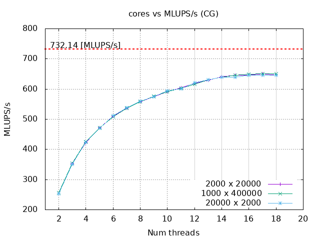
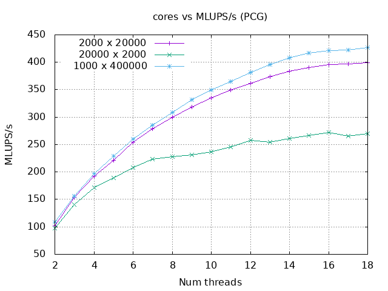
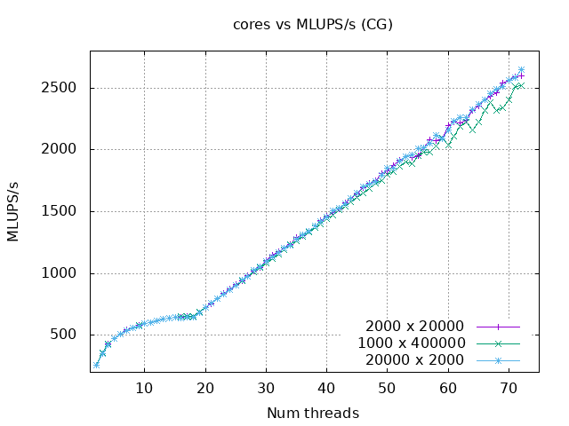
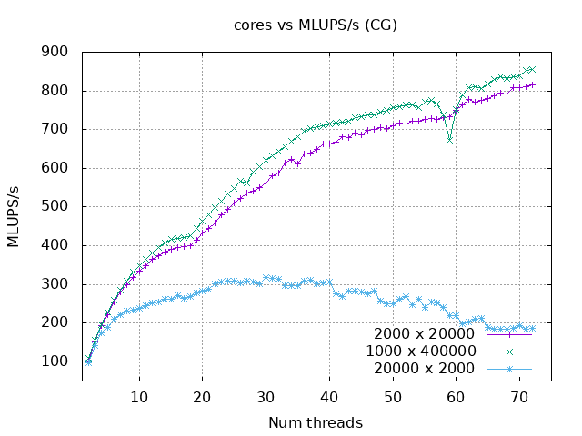

# Performance Modelling And optimization of 2D steady-state heat equation

## Background: Modelling 2D steady-state heat equation
This code solves a linear system of equations to find a steady-state temperature distribution on a rectangular plate using the Conjugate Gradient (CG) and Preconditioned Conjugate Gradient (PCG) with symmetric Gauss-Seidel preconditioning methods.

## Usage
1) Compile program by calling
    ```bash
    CXX=<compiler icpx or g++> make
    ```

    To print additional debug output during the execution, compile with `-DDEBUG`:
   ```bash
   CXX=<compiler icpx or g++> make EXTRA_FLAGS=-DDEBUG
   ```

   To compile with LIKWID use:
   ```bash
   LIKWID=on CXX=<compiler icpx or g++> make
   ```

1)  Run tests by running
    ```bash
    ./test
    ```

2)  Run performance tests by running
    ```bash
    ./perf <grid size y> <grid size x>
    ```

    ## Performance Results (1 CC NUMA Domain)

    ### Conjugate Gradient (CG)
    

    The graph shows CG performance across different grid sizes. The red line indicates the roofline model, which represents the theoretical peak performance limit of the system.

    ### Preconditioned Conjugate Gradient (PCG)
    

    The graph shows PCG performance with symmetric Gauss-Seidel preconditioning. The red line indicates the roofline model, representing the maximum achievable performance based on memory bandwidth and compute capability.

    ## Performance Results (Full Node)

    ### Conjugate Gradient (CG)
    

    The graph shows CG performance across different grid sizes on the full node. The red line indicates the roofline model, which represents the theoretical peak performance limit of the system.

    ### Preconditioned Conjugate Gradient (PCG)
    

    The graph shows PCG performance with symmetric Gauss-Seidel preconditioning on the full node. The red line indicates the roofline model, representing the maximum achievable performance based on memory bandwidth and compute capability.

    